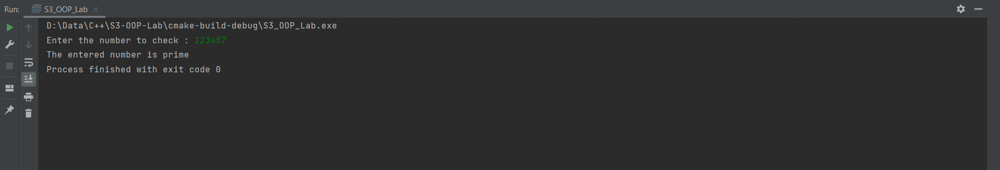
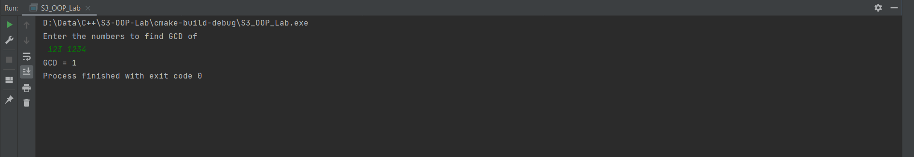
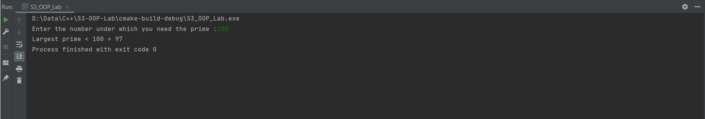

## Question 1
❔ Write a program to check whether the given number is prime or not.

### Program

```cpp
#include <iostream>

int main() {
    int number;

    std::cout << "Enter the number to check :";
    std::cin >> number;

    for (int i = 2; i < sqrt(number); i++)
        if (!(number % i))
            return std::cout << "The number is not prime", 0;

    std::cout << "The entered number is prime";
    return 0;
}
```

### Algorithm

### Output

```text
Enter the number to check :123457
The entered number is prime
Process finished with exit code 0
```



## Question 2
❔ Write a program to find gcd of 2 numbers.

### Program

```cpp
#include <iostream>

int main() {
    int a, b;

    std::cout << "Enter the numbers to find GCD of\n";
    std::cin >> a >> b;

    if (!((a - b) * a * b))
        return std::cout << "GCD = " << (a != 0) * a + (a == 0) * b, 0;

    if (std::min(a, b) - a) {
        a += b;
        b = a - b;
        a = a - b;
    }

    for (int tmp; a; b = tmp) {
        tmp = a;
        a = b % a;
    }

    std::cout << "GCD = " << b;
    return 0;
}
```

### Algorithm

>1) strat
>2) read numbers a and b
>3)  if a=0,b=0, or a=b
>>3.1) if a = b print a
>>3.2) if a = 0 print b
>>3.3) if b=0 print a
>4) set minimum as a and maximum as b
>5) repeat the steps while a!=0
>>5.1) temp = a
>>5.2) a= b%a
>>5.3) b=temp
>6) print b
>7) stop

### Output

```text
Enter the numbers to find GCD of
 123 1234
GCD = 1
Process finished with exit code 0
```



## Question 3
❔ Write a program to find last prime number before the entered input.

### Program

```cpp
#include <iostream>

int main() {
    int number;

    std::cout << "Enter the number under which you need the prime :";
    std::cin >> number;

    if (number < 3)
        return std::cout << "No primes less than " << number << " found", 0;

    int *primes = new int[number/2];
    int primes_found = 1;

    primes[0] = 2;

    for (int i = 3; i < number; i++) {
        bool prime = true;

        for (int j = 0; j < primes_found; j++)
            if (i % primes[j] == 0) {
                prime = false;
                break;
            }

        if (prime)
            primes[primes_found++] = i;
    }

    std::cout << "Largest prime < " << number << " = " << primes[primes_found - 1];

    delete[] primes;

    return 0;
}
```

### Algorithm

### Output

```text
Enter the number under which you need the prime :100
Largest prime < 100 = 97
Process finished with exit code 0
```


