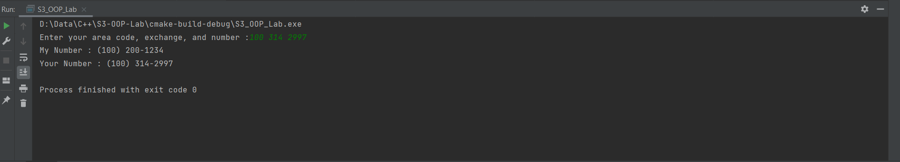
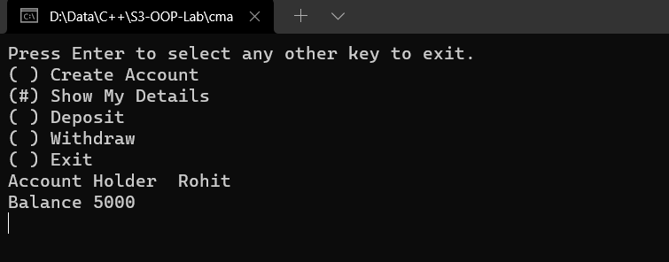
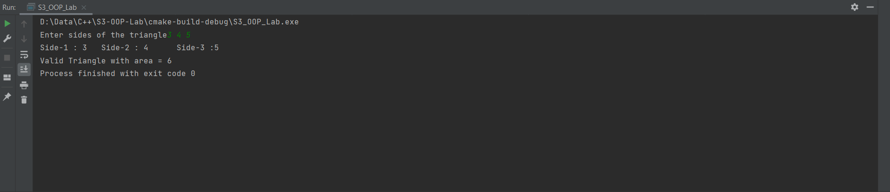

## Question 4
❔ A phone number, such as (212) 767-8900, can be thought of as having
three parts: the area code (212), the exchange (767), and the number
(8900). 

Write a C++ program that uses a structure to store these three
parts of a phone number separately. Call the structure phone. Create two
structure variables of type phone. Initialize one, and have the user input a
number for the other one. Then display both numbers.

The interchange might look like this:

> Enter your area code, exchange, and number: 415 555 1212
> 
> My number is (212) 767-8900
> 
> Your number is (415) 555-1212

### Program

```cpp
#include <iostream>

struct Phone {
    short unsigned int area;
    short unsigned int exchange;
    short unsigned int number;

    void fix()
    {
        area *= (area < 999) - (area > 999);
        exchange *= (exchange < 999) - (exchange > 999);
        number *= (number < 9999) - (number > 9999);
    }

    bool isValid() const
    {
        return area < 999 && exchange < 999 &&  number < 9999 &&
                area > 100 && exchange > 100 && number > 1000;
    }
};

int main() {
    Phone myNumber{100, 200, 1234};
    Phone yourNumber{};

    std::cout << "Enter your area code, exchange, and number :";
    std::cin >> yourNumber.area >> yourNumber.exchange >> yourNumber.number;

    yourNumber.fix();

    if(!yourNumber.isValid())
        return std::cout << "Invalid number", 1;

    std::cout << "My Number : ";
    std::cout << "(" << myNumber.area << ") " << myNumber.exchange << "-" << myNumber.number << "\n";

    std::cout << "Your Number : ";
    std::cout << "(" << yourNumber.area << ") " << yourNumber.exchange << "-" << yourNumber.number << "\n";

    return 0;
}
```

### Algorithm

```
 1.  Start
 2.  Declare a structure Phone with 
	 2.1 data members area,exchange,number
	2.2 function fix change all negative numbers to positive
	2.3 function is_valid checks the validity of number return true if valid else return false
 3. create an object of Phone with default values (myNumber) and one empty object (yourNumber)
 4.  read values to yourNumber
 5. yourNumber.fix()
 6. if yourNumber is not valid then print phone_number is not valid
 7. else print myNumber , yourNumber
 8. stop
```

### Output

```text
Enter your area code, exchange, and number :314 273 2997
My Number : (100) 200-1234
Your Number : (314) 273-2997

Process finished with exit code 0
```



## Question 5
❔ Define a class Date that contains details like year, month and date. Write
a C++ program to check the validity of the date that you enter and display
the next date.

### Program

```cpp
#include <iostream>

class Date {
private:
    int year = 0;
    int month = 0;
    int day = 0;

    static bool isLeap(int year) {
        return (year % 4 == 0 && year % 100 != 0) || year % 400 == 0;
    }

public:

    constexpr static const int max_days[13] = {-1, 31, 28, 31, 30, 31, 30, 31, 31, 30, 31, 30, 31};

    Date(int day, int month, int year) {
        this->year = year;
        this->month = month;
        this->day = day;
    }

    Date() = default;

    const char *isValid() const {
        return (this->year > 0 && this->month > 0 && this->day > 0 &&
                this->month < 13 && this->day <= (max_days[this->month] + (this->month == 2 && isLeap(this->year)))) ?
               "Valid" : "Not Valid";
    }

    Date next() {
        if (this->day >= (max_days[this->month] + (this->month == 2 && isLeap(this->year)))) {
            this->month = (this->month + 1) % 12;
            this->day = 1;
            this->year += this->month == 1;
        } else
            this->day++;

        return *this;
    }

    void print() const {
        std::cout << this->day << "/ " << this->month << "/ " << this->year << std::endl << std::endl;
    }

    void read() {
        std::cin >> this->day >> this->month >> this->year;
    }
};

int main() {
    Date date1 = Date(31, 12, 2020);
    Date date2 = Date();

    std::cout << "Enter a date :";
    date2.read();

    std::cout << "Date 1 : " << date1.isValid() << " ";
    date1.print();
    std::cout << " Next Date : ";
    date1.next().print();

    std::cout << "Date 2 : " << date2.isValid() << " ";
    date2.print();
    std::cout << " Next Date : ";
    date2.next().print();

    return 0;
}
```

### Algorithm

```markdown
```

### Output

```text
Enter a date :28 2 2021
Date 1 : 31/ 12/ 2020 Valid
 Next Date : 1/ 1/ 2021

Date 2 : 28/ 2/ 2021 Valid
 Next Date : 1/ 3/ 2021

Process finished with exit code 0
```


## Question 6
❔ Define a class to represent bank account. Include members like name of
depositor, account no, Type of account, balance amount in the account.
Write C++ program with member functions to: 
1) Assign initial values 
2) To deposit an account 
3) To withdraw an amount after checking the balance
4) To display name and balance

### Program

```cpp
#include <iostream>
#include <conio.h>

class Account {
private:
    std::string name;
    long int number{};
    float balance{};
    std::string type;

public:
    void init() {
        std::cout << "Enter name :";
        std::cin >> name;

        std::cout << "Enter Account Number :";
        std::cin >> number;

        std::cout << "Enter Balance :";
        std::cin >> balance;

        std::cout << "Enter Account Type :";
        std::cin >> type;
    }

    void deposit() {
        std::cout << "Enter amount deposit" << std::endl;
        float amount;
        std::cin >> amount;

        this->balance += amount;
    }

    void withdraw() {
        std::cout << "Enter amount to withdraw. ( Current balance: " << this->balance << " )" << std::endl;
        float amount;

        std::cin >> amount;

        if (this->balance - amount < 500)
            std::cout << "In sufficient balance" << std::endl;
        else
            this->balance -= amount;

        getchar();
        getchar();
    }

    void print() {
        std::cout << "Account Holder\t" << name << std::endl << "Balance\t" << balance << std::endl;
        getchar();
    }

};

void highlight_option(int index, char options[][16], int items) {
    std::cout << "\033[2J\033[1;1H" << std::flush;
    std::cout << "Press Enter to select any other key to exit." << std::endl;

    for (int i = 0; i < items; i++)
        if (i == index)
            std::cout << "(#) " << options[i] << std::endl;
        else
            std::cout << "( ) " << options[i] << std::endl;
}

int handle_key() {
    unsigned char ch = _getch();

    if (ch == 224)
        return _getch() == 72 ? -1 : 1;

    return ch == 13 ? 0 : 2;
}

int get_choice(char menu_options[][16], int items = 4) {
    int menu_index = 0;

    while (true) {
        highlight_option(menu_index, menu_options, items);
        int action = handle_key();

        if (!action)
            break;
        if (action > 1)
            return items + 1;

        menu_index = (menu_index + action) % items;
    }

    return menu_index;
}

int main() {
    char menu_options[][16] = {
            "Create Account",
            "Show My Details",
            "Deposit",
            "Withdraw",
            "Exit"
    };

    int items = 5;
    int choice = 0;

    Account account;

    while (choice < items) {
        choice = get_choice(menu_options, items);
        switch (choice) {
            case 0:
                account.init();
                break;
            case 1: {
                account.print();
                break;
            }
            case 2:
                account.deposit();
                break;
            case 3:
                account.withdraw();
                break;
            default:
                return 0;
        }
    }

    return 0;
}
```

### Algorithm

### Output

```text
Enter name :Rohit
Enter Account Number :123456789
Enter Balance :2000
Enter Account Type :SB
Enter Deposit :1500
Enter Withdraw :3000
Withdraw Success
Account Holder  Rohit
Balance 500

Process finished with exit code 0
```



## Question 7
❔ Write a class which represents the shape triangle. The member functions
should :
1) Check the validity of the triangle 
2) display the sides 
3) find the area and display it.

### Program

```cpp
#include <iostream>
#include <cmath>

class Triangle {
private:
    float a{}, b{}, c{};

public:
    Triangle() = default;

    bool isValid() const {
        return (a + b > c) && (a + c > b) && (b + c > a) && a > 0 && b > 0 && c > 0;
    }

    float getArea() const
    {
        float s = (a + b + c) / 2;
        return sqrt(s * (s - a) * (s - b) * (s - c));
    }

    void print() const
    {
        std::cout << "Side-1 : " << a << "\tSide-2 : " << b << "\tSide-3 :" << c << std::endl;
    }

    friend std::istream &operator>>(std::istream &is, Triangle &triangle) {
        is >> triangle.a >> triangle.b >> triangle.c;
        return is;
    }
};

int main()
{
    Triangle triangle = Triangle();

    std::cout << "Enter sides of the triangle";
    std::cin >> triangle;

    triangle.print();

    if(!triangle.isValid())
        std::cout << "Invalid Triangle";
    else
        std::cout << "Valid Triangle with area = " << triangle.getArea();

    return 0;
}
```

### Algorithm

### Output

```text
Enter sides of the triangle3 4 5
Side-1 : 3   Side-2 : 4      Side-3 :5
Valid Triangle with area = 6
Process finished with exit code 0
```


