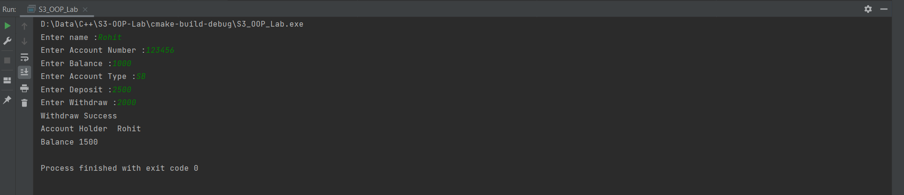

## Question 1
❔ A phone number, such as (212) 767-8900, can be thought of as having
three parts: the area code (212), the exchange (767), and the number
(8900). 

Write a C++ program that uses a structure to store these three
parts of a phone number separately. Call the structure phone. Create two
structure variables of type phone. Initialize one, and have the user input a
number for the other one. Then display both numbers.

The interchange might look like this:

> Enter your area code, exchange, and number: 415 555 1212
> 
> My number is (212) 767-8900
> 
> Your number is (415) 555-1212

### Program

```cpp
#include <iostream>

struct Phone {
    short int area;
    short int exchange;
    short int number;
};

int main() {
    Phone myNumber{100, 200, 1234};
    Phone yourNumber{};

    std::cout << "Enter your area code, exchange, and number :";
    std::cin >> yourNumber.area >> yourNumber.exchange >> yourNumber.number;

    std::cout << "My Number : ";
    std::cout << "(" << myNumber.area << ") " << myNumber.exchange << "-" << myNumber.number << "\n";

    std::cout << "Your Number : ";
    std::cout << "(" << yourNumber.area << ") " << yourNumber.exchange << "-" << yourNumber.number << "\n";

    return 0;
}
```

### Algorithm

```markdown
```

### Output

```text
Enter your area code, exchange, and number :314 273 2997
My Number : (100) 200-1234
Your Number : (314) 273-2997

Process finished with exit code 0
```


## Question 2
❔ Define a class Date that contains details like year, month and date. Write
a C++ program to check the validity of the date that you enter and display
the next date.

### Program

```cpp
#include <iostream>

class Date {
private:
    int year = 0;
    int month = 0;
    int day = 0;

    static bool isLeap(int year) {
        return (year % 4 == 0 && year % 100 != 0) || year % 400 == 0;
    }

public:

    constexpr static const int max_days[13] = {-1, 31, 28, 31, 30, 31, 30, 31, 31, 30, 31, 30, 31};

    Date(int day, int month, int year) {
        this->year = year;
        this->month = month;
        this->day = day;
    }

    Date() = default;

    const char *isValid() const {
        return (this->year > 0 && this->month > 0 && this->day > 0 &&
                this->month < 13 && this->day <= (max_days[this->month] + (this->month == 2 && isLeap(this->year)))) ?
               "Valid" : "Not Valid";
    }

    friend Date operator++(Date &date) {
        if (date.day >= (max_days[date.month] + (date.month == 2 && isLeap(date.year)))) {
            date.month = date.month++ % 12;
            date.day = 1;
            date.year += date.month == 1;
        } else
            date.day++;

        return date;
    }

    friend std::ostream &operator<<(std::ostream &out, Date &date) {
        return out << date.day << "/ " << date.month << "/ " << date.year;
    }

    friend std::istream &operator>>(std::istream &is, Date &date) {
        is >> date.day >> date.month >> date.year;
        return is;
    }
};

int main() {
    Date date1 = Date(31, 12, 2020);
    Date date2 = Date();
    Date next;

    std::cout << "Enter a date :";
    std::cin >> date2;

    std::cout << "Date 1 : " << date1 << " " << date1.isValid() << std::endl;
    next = ++date1;
    std::cout << " Next Date : " << next << std::endl << std::endl;

    std::cout << "Date 2 : " << date2 << " " << date2.isValid() << std::endl;
    next = ++date2;
    std::cout << " Next Date : " << next << std::endl;

    return 0;
}
```

### Algorithm

```markdown
```

### Output

```text
Enter a date :28 2 2021
Date 1 : 31/ 12/ 2020 Valid
 Next Date : 1/ 1/ 2021

Date 2 : 28/ 2/ 2021 Valid
 Next Date : 1/ 3/ 2021

Process finished with exit code 0
```


## Question 3
❔ Define a class to represent bank account. Include members like name of
depositor, account no, Type of account, balance amount in the account.
Write C++ program with member functions to: 
1) Assign initial values 
2) To deposit an account 
3) To withdraw an amount after checking the balance
4) To display name and balance

### Program

```cpp
#include <iostream>

class Account {
private:
    std::string name;
    long int number{};
    float balance{};
    std::string type;

public:
    void init(std::string &newName, long int newNumber, float newBalance, std::string &newType) {
        name = newName;
        number = newNumber;
        balance = newBalance;
        type = newType;
    }

    void deposit(const float amount) {
        this->balance += amount;
    }

    bool withdraw(const float amount) {
        if (amount > this->balance)
            return false;

        this->balance -= amount;

        return true;
    }

    void print() {
        std::cout << "Account Holder\t" << name << std::endl << "Balance\t" << balance << std::endl;
    }

};

int main() {
    Account account;

    std::string name;
    long int number;
    float balance;
    std::string type;

    std::cout << "Enter name :";
    std::cin >> name;

    std::cout << "Enter Account Number :";
    std::cin >> number;

    std::cout << "Enter Balance :";
    std::cin >> balance;

    std::cout << "Enter Account Type :";
    std::cin >> type;

    account.init(name, number, balance, type);

    std::cout << "Enter Deposit :";
    std::cin >> balance;

    account.deposit(balance);

    std::cout << "Enter Withdraw :";
    std::cin >> balance;

    std::cout << (account.withdraw(balance) ? "Withdraw Success" : "Insufficient Balance") << std::endl;

    account.print();

    return 0;
}
```

### Algorithm

### Output

```text
Enter name :Rohit
Enter Account Number :123456789
Enter Balance :2000
Enter Account Type :SB
Enter Deposit :1500
Enter Withdraw :3000
Withdraw Success
Account Holder  Rohit
Balance 500

Process finished with exit code 0
```



## Question 4
❔ Write a class which represents the shape triangle. The member functions
should :
1) Check the validity of the triangle 
2) display the sides 
3) find the area and display it.

### Program

```cpp
#include <iostream>
#include <cmath>

class Triangle {
private:
    float a{}, b{}, c{};

public:
    Triangle() = default;

    bool isValid() const {
        return (a + b > c) && (a + c > b) && (b + c > a) && a > 0 && b > 0 && c > 0;
    }

    float getArea() const
    {
        float s = (a + b + c) / 2;
        return sqrt(s * (s - a) * (s - b) * (s - c));
    }

    void print() const
    {
        std::cout << "Side-1 : " << a << "\tSide-2 : " << b << "\tSide-3 :" << c << std::endl;
    }

    friend std::istream &operator>>(std::istream &is, Triangle &triangle) {
        is >> triangle.a >> triangle.b >> triangle.c;
        return is;
    }
};

int main()
{
    Triangle triangle = Triangle();

    std::cout << "Enter sides of the triangle";
    std::cin >> triangle;

    triangle.print();

    if(!triangle.isValid())
        std::cout << "Invalid Triangle";
    else
        std::cout << "Valid Triangle with area = " << triangle.getArea();

    return 0;
}
```

### Algorithm

### Output

```text
Enter sides of the triangle3 4 5
Side-1 : 3   Side-2 : 4      Side-3 :5
Valid Triangle with area = 6
Process finished with exit code 0
```


