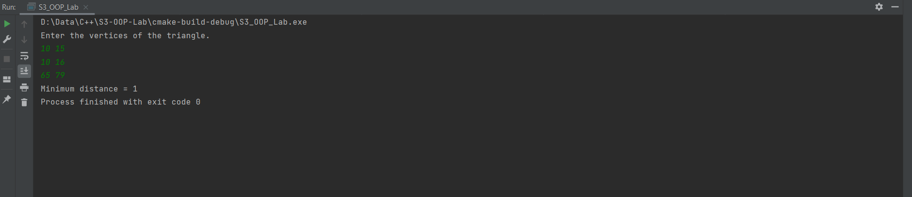

## Question 8
❔ Write  class which contains an integer arrayand a static function to find the average of that array and other necessary member functions. Create THREE objects. Read the values into the array using one object, and find
the average. Let the second object modifies the value by multiplying each element by a certain multiplier. Repeat the process of finding the average using first object. Using the third object arrange the numbers in ascending
order and print

### Program

```cpp
#include <iostream>

class Array {
public:
    static int *data;
    static int length;

    static float getAverage() {
        int sum = 0;
        for (int i = 0; i < length; sum += data[i++]);

        return (float) sum / (float) length;
    }

    static void readData() {
        std::cout << "Enter how many numbers you want to enter : ";
        int a;
        std::cin >> a;

        length = a;
        data = new int[length];
        for (int i = 0; i < length; std::cin >> data[i++]);
    }

    static void scale(int factor) {
        for (int i = 0; i < length; data[i++] *= factor);
    }

    static void sort() {
        for (int i = 0; i < length - 1; i++)
            for (int j = 0; j < length - i - 1; j++)
                if (data[j] > data[j + 1]) {
                    int temp = data[j];
                    data[j] = data[j + 1];
                    data[j + 1] = temp;
                }
    }

    static void print() {
        for (int i = 0; i < length; std::cout << data[i++] << '\t');
    }
};

int* Array :: data = new int[1];
int Array :: length = 0;

int main() {
    Array array1, array2, array3;
    int m;

    array1.readData();
    std::cout << "Average = " << array1.getAverage() << std::endl;
    std::cout << "By what number do you want to multiply.";
    std::cin >> m;
    array2.scale(m);
    std::cout << "Average = " << array1.getAverage() << std::endl;
    array3.sort();
    array3.print();
}
```

### Algorithm

```markdown
```

### Output

```text
Enter your area code, exchange, and number :314 273 2997
My Number : (100) 200-1234
Your Number : (314) 273-2997

Process finished with exit code 0
```


## Question 5
❔ Write a program to find the shortest distance between three coordinates points, representing vertices of a triangle, using inline function. Also check the validity of the sides to make a triangle.

### Program

```cpp
#include <iostream>

struct Point {
    int x;
    int y;
};

inline double distance(Point a, Point b, Point c) {
    int abx = a.x - b.x;
    int aby = a.y - b.y;
    int acx = a.x - c.x;
    int acy = a.y - c.y;
    int bcx = b.x - c.x;
    int bcy = b.y - c.y;

    return std::min(std::min(sqrt(abx * abx + aby * aby), sqrt(acx * acx + acy * acy)), sqrt(bcx * bcx + bcy * bcy));
}

int main()
{
    Point a{},b{},c{};

    std::cout << "Enter the vertices of the triangle." << std::endl;
    std::cin >> a.x >> a.y;
    std::cin >> b.x >> b.y;
    std::cin >> c.x >> c.y;

    std::cout << "Minimum distance = " << distance(a,b,c);
}
```

### Algorithm

```markdown
```

### Output

```text
Enter the vertices of the triangle.
10 15
10 16
65 79
Minimum distance = 1
Process finished with exit code 0
```

